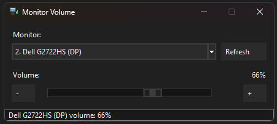
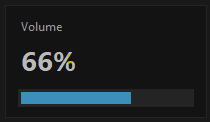

# windows-ddc

`windows-ddc` is a Windows desktop application that sends the system Volume Up and Volume Down keys to one DDC/CI-capable monitor. It also provides a small Tkinter control window, a notification-area icon, and an on-screen volume overlay.

It controls the monitor's DDC/CI audio-volume value, not the Windows audio mixer, application volumes, brightness, or mute state.

## Screenshots

### Control window



### Volume overlay



## Features

- Discovers DDC/CI monitors and lets the user select one target.
- Reads and writes the selected monitor's volume in the `0`–`100` range.
- Provides a slider and `-`/`+` buttons with one-point steps.
- Intercepts the global Windows Volume Down and Volume Up keys while a target is ready.
- Shows a bottom-centered overlay with best-effort topmost placement and a 1.4-second timer after the most recent overlay update.
- Starts in the Windows notification area, with Restore and Exit actions.
- Remembers the selected monitor across launches.
- Follows the current user's Windows light/dark application preference at startup.
- Keeps DDC/CI work off Tk's UI thread and coalesces rapid volume changes.

> [!IMPORTANT]
> Once a monitor has been selected and its volume read successfully, Volume Up and Volume Down are consumed globally by this application. They no longer change Windows system volume until the application is exited or loses readiness. The mute key is not intercepted.

## Technology and runtime

| Area | Implementation |
| --- | --- |
| User interface | Python `tkinter` / `ttk` |
| Monitor control | `monitorcontrol==4.2.0` over DDC/CI |
| Windows integration | `ctypes` calls to User32, Kernel32, Shell32, and optional DWM APIs |
| Source packaging | setuptools with flat `py-modules` |
| Executable build | `Nuitka==2.4.8`, one-file Windows executable |
| Persistent app data | One per-user JSON settings file |

The runtime is one interactive user-session process. It is not a Windows service and does not open a port, expose an HTTP API, use a database, or contact a runtime network service. See [Architecture](docs/ARCHITECTURE.md) for the process, thread, and event flows.

## Requirements

- Windows 10 or Windows 11. These are the documented targets; the repository has no automated OS compatibility matrix.
- A monitor with DDC/CI enabled in its on-screen display and support for DDC/CI audio-volume reads and writes.
- For source execution: Python 3.10 or newer with Tkinter available.
- For local executable builds: the optional build dependencies described below.

No administrator workflow is implemented or requested by the application. Run it in the interactive Windows user session whose volume keys and monitor should be controlled.

## Install and first run

### Use the release executable

The [0.1.0 release](https://github.com/fensoft/windows-ddc/releases/tag/0.1.0) contains the prebuilt `windows-ddc.exe` asset. Download the executable, place it in a user-controlled location, and run it. It is a standalone one-file application; there is no installer or automatic-startup registration in this repository.

The working tree's ignored `dist\` directory is not the distribution source and may be empty. The repository also does not define executable signing or publishing automation.

### Run from source

From PowerShell:

```powershell
git clone https://github.com/fensoft/windows-ddc.git
Set-Location windows-ddc
python -m pip install -e .
python app.py
```

`python -m pip install -e .` installs the pinned runtime dependency and creates local packaging metadata. It may contact the configured Python package index.

The supported source launcher is `app.py`. `main.py` is an intentional compatibility stub that prints:

```text
This launcher is no longer supported. Run: python app.py
```

and exits with status `1`. `windows-ddc` itself defines no console entry point or application command-line options.

### First-run workflow

1. Enable DDC/CI in the monitor's on-screen settings before starting the application.
2. Start `windows-ddc.exe` or run `python app.py`.
3. Look in the notification area, including its overflow menu. A successful tray initialization hides the control window immediately.
4. Double-click the tray icon, or right-click it and choose **Restore**.
5. Choose the intended monitor and wait for the status bar to report a successful volume read.
6. Test at a safe listening level with the buttons or slider before relying on the global volume keys.

The first detected monitor is selected when no saved selection matches. Run only one copy: the application has no single-instance guard, and multiple copies can install competing global hooks and race over the same settings file.

## Operation

| Action | Behavior |
| --- | --- |
| Start | Creates the tray and keyboard-hook threads, hides in the notification area when the tray is available, then discovers monitors in the background. |
| Restore | Double-click the tray icon or use **Restore**. The tray icon is hidden while the control window is visible. |
| Select a monitor | Choose it in the read-only list. The selection is saved before its volume read completes. |
| Change volume | Use `-`, `+`, release the slider, or press Volume Down/Up. Values are clamped to `0`–`100`; writes are followed by a readback. |
| Refresh | Re-enumerates monitors and reads the selected monitor again. Use it after hotplug, topology, or external OSD volume changes. |
| Minimize | Sends the control window back to the notification area. |
| Close the restored window | Exits the application; it does not merely hide the window. |
| Exit from the tray | Removes the hook and tray icon, closes the overlay, and exits. |

Monitor discovery is not periodic, and the displayed value is not polled for changes made by another program or the monitor's OSD. Refresh before acting on a value that may have changed externally.

A DDC write and its readback are not transactional. If the write succeeds but readback fails, the monitor may already have changed even though the application reports an error and restores its cached display value. Volume changes are not rolled back when the application exits.

The UI range is `0`–`100`, but a monitor can report a lower device maximum and reject a higher target. That dependency error is shown in the status bar.

## Startup validation and status

There is no separate health command, readiness endpoint, log file, or console in the packaged executable. The control window's status bar is the diagnostic surface.

| Status shape | Meaning |
| --- | --- |
| `Searching for monitors...` | DDC/CI enumeration and the initial read are running. |
| `Ready. N monitor(s) detected...` | A selected monitor volume was read; controls and global key interception are enabled. |
| `No DDC/CI monitors found.` | Enumeration returned no monitor wrappers. |
| A read/write/detection error | The underlying operation failed; the status contains the formatted exception text. |
| `Volume-key listener failed: ...` | The global hook failed. The GUI may still control the monitor. |
| `Tray icon failed: ...` | A native notification-area operation failed. |

Volume controls and key interception remain disabled until a selected monitor has a readable volume during normal startup. Refresh remains available whenever no operation is busy. A later hotplug or stale-monitor write failure does not currently clear that readiness state; use **Refresh** or exit the application if the hardware volume keys keep being consumed after a failure.

## Configuration and persistent data

There are no application-specific environment variables, CLI flags, environment templates, or administrative settings. The only environment input is the standard Windows `APPDATA` location used to place the settings file.

| Input or field | Default | Effect |
| --- | --- | --- |
| `APPDATA` | If unset or empty, `Path.home()` | Base directory for the `windows-ddc` settings folder. |
| `selected_monitor.description` | No saved value | Monitor description reported by the DDC library. |
| `selected_monitor.ordinal` | No saved value | One-based occurrence among monitors with the same description. |

The normal settings path is:

```text
%APPDATA%\windows-ddc\settings.json
```

If `APPDATA` is unavailable, the fallback is:

```text
<home>\windows-ddc\settings.json
```

The exact schema is:

```json
{
  "selected_monitor": {
    "description": "Monitor description",
    "ordinal": 1
  }
}
```

Writes go to sibling `settings.tmp` first and then replace `settings.json`. There is no schema version, migration system, file lock, or multi-process coordination. The durable identity is description plus duplicate ordinal—not EDID, serial number, or the displayed numeric index—so reordering identical monitors can change which physical device a saved key selects. If the saved key is absent, the first enumerated monitor is selected and saved.

Missing, unreadable, syntactically invalid, or invalid nested settings are normally treated as no selection. In version `0.1.0`, valid JSON whose top-level value is not an object can raise an unhandled startup error; restore a valid object or move that file aside.

The settings file contains monitor selection only, not volume, credentials, or secrets. The actual volume is monitor hardware state and is read again at startup.

## Backup and restore

There is no built-in backup format. Exit the application first, then copy the JSON file. For the normal Windows path:

```powershell
$backupPath = Join-Path ([Environment]::GetFolderPath('MyDocuments')) 'windows-ddc-settings.json.backup'
Copy-Item -LiteralPath "$env:APPDATA\windows-ddc\settings.json" -Destination $backupPath
```

To restore, exit every application instance, verify the backup contains the schema above, then run:

```powershell
$backupPath = Join-Path ([Environment]::GetFolderPath('MyDocuments')) 'windows-ddc-settings.json.backup'
New-Item -ItemType Directory -Force -Path "$env:APPDATA\windows-ddc" | Out-Null
Copy-Item -LiteralPath $backupPath -Destination "$env:APPDATA\windows-ddc\settings.json" -Force
```

Choose another user-controlled backup location outside the checkout if Documents is unsuitable, and never commit the backup. If `APPDATA` is unset, substitute the fallback path documented above. Moving `settings.json` aside resets monitor selection on the next launch; it does not reset monitor volume.

## Interfaces and security boundaries

- `windows-ddc` has no supported application CLI, subcommands, or flags beyond launching `app.py` or the executable.
- Installing the dependency also installs the upstream `monitorcontrol` console command. It is not a `windows-ddc` interface and can directly change monitor volume, brightness, power, mute, or input; do not use it unless that hardware operation is intentional.
- There are no HTTP routes, ports, realtime sockets, external runtime services, accounts, authentication, or authorization roles.
- The process loads native Windows libraries and installs a desktop-wide low-level keyboard hook. Unrelated keys are passed onward; Volume Down and Volume Up are swallowed only when the application's readiness flag is active.
- DDC/CI writes cross the process boundary into physical monitor hardware and may have an audible effect.
- The application reads the current user's Windows theme preference from the registry; it does not write the registry.
- Runtime settings contain no secrets. Do not add credentials or tokens to the tracked repository or the settings schema without an explicit security design.

## Build the executable

Install the runtime and pinned build tooling:

```powershell
python -m pip install -e .[build]
```

Then run the repository build script:

```powershell
.\build_exe.ps1
```

Expected output:

```text
dist\windows-ddc.exe
```

The script resolves the `python` command, changes to the repository root, verifies `app.py` and `windows-ddc.ico`, and executes this Nuitka command shape:

```powershell
python -m nuitka --onefile --windows-console-mode=disable --enable-plugins=tk-inter --windows-icon-from-ico=windows-ddc.ico --include-data-files=windows-ddc.ico=windows-ddc.ico --output-dir=dist --output-filename=windows-ddc.exe --remove-output --assume-yes-for-downloads app.py
```

The icon is both the executable icon and runtime data because `theme.py` loads a sibling `windows-ddc.ico`. The build can download Nuitka support/toolchain components, writes the named artifact under `dist\`, may overwrite an existing artifact, and removes its intermediate build directory. `dist\` is ignored. No installer, signing step, CI build, or release-publishing workflow is defined.

## Development and testing

Install the editable runtime environment before developing:

```powershell
python -m pip install -e .
```

The repository has no automated test suite, lint/type/format configuration, or CI workflow. The following safe checks cover syntax and repository formatting without launching the UI, installing a hook, or contacting monitor hardware:

```powershell
python -m compileall -q app.py ddc.py gui.py main.py overlay.py settings.py theme.py windows_platform.py
python -m pip check
git diff --check
git diff --cached --check
git status --short
```

Parse the PowerShell build script without executing it:

```powershell
$tokens = $null
$parseErrors = $null
[System.Management.Automation.Language.Parser]::ParseFile(
    (Resolve-Path .\build_exe.ps1),
    [ref]$tokens,
    [ref]$parseErrors
) | Out-Null
if ($parseErrors.Count -ne 0) { $parseErrors; exit 1 }
```

Changes to GUI, tray, hook, or DDC behavior still require an authorized manual test on Windows with a compatible monitor. Back up the live selection settings first. At minimum, verify discovery, selection persistence, volume read/write and readback, overlay timing, key pass-through before readiness, key capture after readiness, minimize/restore, Refresh after topology changes, and clean exit. These tests can change physical monitor volume and user-session keyboard behavior.

For repository-specific maintainer rules, read [AGENTS.md](AGENTS.md).

## Troubleshooting

| Symptom | What to check |
| --- | --- |
| No window appears | Check the notification area and its overflow menu, then double-click the icon or choose **Restore**. Tray-first startup is expected. |
| The process runs but no tray icon/window is reachable | Exit it with Task Manager and relaunch. Tray addition is asynchronous, so a native tray failure can occur after the main window has been hidden. |
| `No DDC/CI monitors found.` | Enable DDC/CI in the monitor OSD, confirm the monitor exposes DDC/CI over the active connection, then choose **Refresh**. |
| A monitor is listed but volume remains `--` | Enumeration succeeded but its volume read did not. Read the status, try another monitor, and confirm the target supports DDC/CI audio volume. |
| `monitorcontrol is not installed...` | From the repository root, rerun `python -m pip install -e .`. |
| Volume keys still change Windows audio | Restore the UI and wait for a successful volume read. If `Volume-key listener failed` appeared, the buttons/slider may work but global keys will not. |
| Volume keys stop changing Windows audio | This is expected while the app is ready. Close the restored window, or use tray **Exit** while minimized, to restore normal system-volume behavior. |
| Keys are consumed after unplugging the monitor | Choose **Refresh** or exit. Current readiness is not cleared by every later write failure. |
| The wrong physical monitor is controlled | Restore the UI and select the target again. Identical descriptions are distinguished only by current enumeration order. |
| The displayed value is stale | Choose **Refresh** after changes made by the monitor OSD, another tool, or a topology change. There is no live polling. |
| Selection is not remembered | Ensure the per-user settings directory is writable and only one instance is running. Save errors are not surfaced. |
| Startup fails after editing settings | Exit the app and move `settings.json` aside or restore a top-level JSON object matching the documented schema. |
| Build fails before compilation | Install `.[build]`, ensure `python` resolves on `PATH`, and keep `app.py` and `windows-ddc.ico` at the repository root. |

## Further documentation

- [Changelog](CHANGELOG.md)
- [Architecture](docs/ARCHITECTURE.md)
- [Coding-agent instructions](AGENTS.md)
